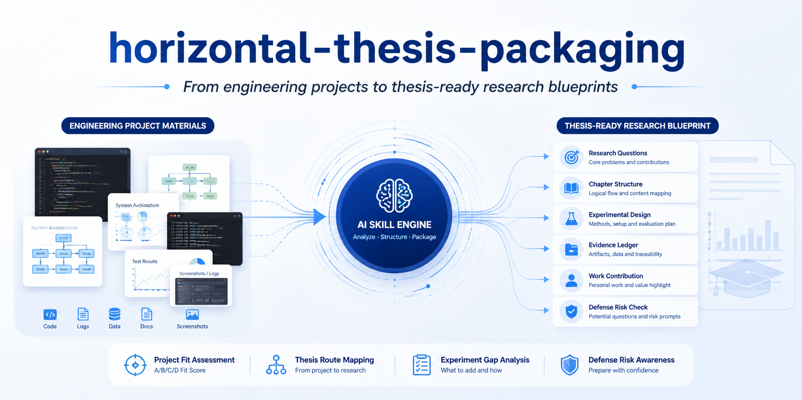
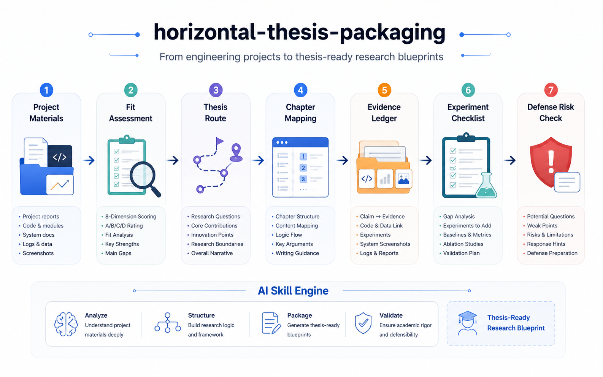

<p align="center">
  
</p>

<h1 align="center">Horizontal Thesis Packaging</h1>

<p align="center">
  <strong>横向项目 → 硕士论文主线</strong> 的诊断与转化系统
</p>

<p align="center">
  
  
  
  
</p>

---

> 天下研究生苦横向久矣。

> **横向项目不是不能写论文，而是不能按项目说明书写。**

---

## 它解决什么问题

> ✦ 横向项目太工程？导师说不像论文？
> ✦ 只有代码、截图、测试表，不知道怎么写开题？
> ✦ 企业数据不能公开，答辩又怕被问"创新点在哪"？

**这个 Skill 不是论文代写。它是一个"横向项目 → 硕士论文主线"的诊断与转化系统。**

把你的项目材料贴进来，它会先判断：**这个项目到底能不能写成硕士论文**。
如果能写，它会继续生成论文转化蓝图；如果风险太高，它会直接告诉你缺什么、怎么补、该不该换主线。

## 工作流

<p align="center">
  
</p>

```text
项目材料
  ↓
A/B/C/D 适配度判断
  ↓
论文主线 + 章节映射 + 证据台账
  ↓
实验补全 + 答辩风险 + 下游论文路线评级
```

---

## 一句话介绍

**Horizontal Thesis Packaging** 是一个面向研究生横向项目、企业合作项目、工程系统、AI 应用、RAG 系统和机器人项目的 Agent Skill。

它帮助你把"我做了一个系统"翻译成：

- 可开题的研究问题
- 可写进论文的研究内容
- 可支撑答辩的本人工作量
- 可验证的实验与测试证据
- 可交给下游论文写作 Skill 的结构化交接包

---

## 爆点能力

### 1. 先判生死：A/B/C/D 论文适配度

不是所有横向项目都适合硬写成论文。这个 Skill 会先做 8 项评分：

| 维度 | 它会判断什么 |
| --- | --- |
| 项目规模 | 是完整系统，还是小页面、小脚本、小接口 |
| 技术问题 | 能不能抽象出效率、准确率、稳定性、实时性等问题 |
| 本人工作量 | 你负责的是核心模块，还是边缘配置和文档 |
| 数据/场景 | 有没有真实数据、日志、案例、仿真或测试样例 |
| 验证可能性 | 能不能补功能测试、性能测试、对比实验或场景验证 |
| 方法含量 | 有没有算法、流程优化、系统架构、集成机制或工程优化 |
| 保密风险 | 企业材料能不能脱敏后写进论文 |
| 时间成本 | 剩余时间够不够补证据，而不是只靠话术包装 |

输出会给出：

```text
A 类：适合单独转论文
B 类：可以转，但必须补证据
C 类：不建议单独转，先降级为模块/案例
D 类：不建议转论文，建议换主线或重找证据
```

### 2. 引导式回答：不会只甩一堆模板

普通 AI 经常直接生成一篇很虚的"系统设计与实现"。
这个 Skill 会按论文风险一步一步追问和引导：

- 项目做什么？
- 你本人做了什么？
- 目前有什么代码、截图、数据、日志、测试？
- 哪些内容能脱敏？
- 哪些结论现在还没有证据支撑？
- 老师最可能追问哪里？

如果材料不足，它不会卡住，也不会编故事，而是给你：

```text
可写版本 + 缺失材料 + 补救动作 + 风险提醒
```

### 3. 证据台账：每个结论都要有来源

它会把论文里的每个 claim 对应到真实材料，避免写成空话。

| 论文 claim | 证据来源 | 当前状态 | 风险 | 补救动作 |
| --- | --- | --- | --- | --- |
| 系统能支撑核心业务流程 | 截图、接口测试、流程记录 | 部分已有 | 像项目说明书 | 补功能测试表 |
| 检索效果优于关键词搜索 | 评价集、baseline、Recall@K | 缺失 | 不能写成结论 | 补对比实验 |
| 系统稳定运行 | 日志、压测、资源占用 | 缺失 | 答辩易被追问 | 补稳定性测试 |

核心原则：

> **没有证据的结论，不建议写成论文结论。**

### 4. 论文路线评级：国内硕士、EI、CCF、SCI、CVPR、Nature 都能评

它不只判断"能不能毕业"，还会判断下游写作路线的相对可行性。

```text
最稳路线：国内硕士论文
次优路线：EI 工程应用
可拓展路线：CCF-C / CCF-B 应用系统类
谨慎路线：SCI
暂不建议：CCF-A / CVPR / Nature
```

它会说明为什么：

- 缺不缺公开数据集？
- 有没有强 baseline？
- 方法创新够不够？
- 实验能不能复现？
- 当前证据更适合毕业、工程应用，还是高水平论文？

> 注意：路线评级只代表当前材料的相对可行性，不承诺投稿或发表结果。

### 5. 记忆系统：可以记住你的导师口径

如果你经常处理同类项目，可以让它生成本地记忆建议。

它适合记住：

- 导师重证据
- 输出要保守
- 不要拔高创新
- 优先说明本人工作量
- 企业数据必须脱敏
- 答辩时要避免"像项目说明书"

它不应该记住：

- 企业真实名称
- 导师真实姓名和私人评价
- 未脱敏数据
- 论文原文
- 内部系统地址、账号、接口 token

写入本地文件前需要用户确认，默认走隐私安全路线。

### 6. 多场景 Profile：不同项目用不同论文口径

内置多种风格预设，不同项目可以切换不同处理方式：

| 场景 | 推荐 Profile |
| --- | --- |
| 横向项目多、主线不清 | `horizontal-lab-default` |
| 后台系统、平台、工程项目 | `engineering-heavy` |
| AI/RAG/模型应用落地 | `algorithm-application-bridge` |
| 机器人、导航、感知、控制 | `robotics-intelligent-system` |
| 企业合作、数据保密 | `enterprise-confidential` |
| 临近毕业、时间很紧 | `graduation-first` |
| 导师严格、怕被追问 | `advisor-strict` |
| 盲审风险高 | `blind-review-safe` |
| 答辩 PPT 和讲稿 | `defense-compressed` |

---

## 30 秒演示

### 输入

```text
我做了一个企业 RAG 知识库，负责文档解析、向量检索、答案引用和后台接口。
现在有代码、测试截图和少量问答样例，但没有完整评价集。
这个项目能不能写成硕士论文？
```

### 输出摘要

```text
结论：B 类，可以转，但必须补证据。

8 项评分：10/16
判断置信度：中

推荐题目：
面向企业知识管理场景的检索增强问答系统设计与实现

最该补的 3 个材料：
1. 脱敏问答评价集
2. baseline 对比：关键词检索、不同切分策略、不同 TopK
3. 指标表：Recall@K、引用准确率、平均响应时间

下游路线：
最稳：国内硕士论文
次优：EI 工程应用
可拓展：CCF-C/CCF-B 应用系统类
暂不建议：CCF-A/CVPR、Nature
```

完整案例：

```text
demo/rag-project-input.md
demo/rag-project-output.md
```

---

## 适合谁

- 研二、研三、专硕，手里有项目但论文主线不清
- 做了企业项目、横向项目、后台系统、数据平台的人
- 做了 AI 应用、RAG 系统、机器人系统，但实验和创新点不稳的人
- 被导师说"太工程了""不像论文""创新点不够"的人
- 只有代码、截图、接口测试，不知道怎么补第五章的人
- 企业数据不能公开，需要脱敏表达和答辩风险控制的人
- 想把项目整理成开题、中期、论文目录、实验方案、答辩 PPT 的人

---

## 它能生成什么

默认完整输出包含：

```text
 1. 项目事实摘要
 2. A/B/C/D 适配度结论
 3. 8 项评分表
 4. 判断置信度
 5. 推荐论文类型
 6. 稳健题目候选
 7. 一句话研究问题
 8. 研究内容和主要特色
 9. 工程模块 → 论文章节映射
10. claim-evidence 证据台账
11. 本人工作量拆分
12. 实验与测试补全清单
13. 盲审/答辩风险
14. 下游论文路线评级
15. 可复制的下游写作提示词
16. 下一步行动建议
```

---

## 项目转简历资产评估

除了判断项目能否转化为论文，本 skill 现在也会判断项目是否适合写进简历。论文转化仍然是主功能；当你只贴项目材料或要求完整评估时，它会在论文判断后主动追加简历资产评估，用于回答“这个项目能不能成为求职项目经历、该怎么克制表达、面试会不会被问穿帮”。

新增能力：

- 判断项目简历价值
- 提炼本人贡献
- 判断适合投递方向
- 生成简历 bullet
- 提醒面试追问风险
- 检查是否存在夸大、涉密、讲不清的问题

使用示例：

```text
请使用 resume-asset-evaluation 模式分析这个横向项目。
我想知道：
1. 它能不能写进简历；
2. 适合投什么岗位；
3. 哪些内容值得强调；
4. 哪些内容不要写；
5. 怎么写成简历 bullet；
6. 面试可能怎么问。

项目简介：
【项目做什么】

我负责：
【本人负责模块、代码、实验、部署、联调、文档】

已有证据：
【代码提交 / 截图 / 实验数据 / 部署记录 / 文档 / 验收材料】

目标岗位：
【算法岗 / 软件开发岗 / 机器人或自动驾驶岗 / AI 工程岗 / 后端平台岗 / 国企研究所工程岗】
```

输出会追加：

```text
## 简历资产转化评估

1. 简历适配评级：A / B / C / D
2. 7 维评分表、评级理由和判断置信度
3. 适合投递方向匹配矩阵
4. 可写进简历的部分
5. 不建议写进简历的部分
6. 本人贡献提炼
7. 可量化指标补全方案
8. 简历 bullet 草稿：保守版、技术版、面试强化版
9. STAR/面试讲述稿
10. 面试追问风险和补证据清单
```

注意：没有真实数据时只建议补指标，不会虚构“提升 XX%”；涉密横向项目会改写为“某工业场景”“某企业项目”“某机器人平台”等脱敏表达。

---

## 快速使用

最快方式：直接把项目材料贴给 Agent。

```text
使用 horizontal-thesis-packaging，帮我判断这个横向项目能不能转硕士论文。

项目简介：
【项目做什么】

我负责：
【本人负责模块】

已有材料：
【代码 / 截图 / 数据 / 日志 / 测试 / 文档】

当前阶段：
【选题 / 开题 / 中期 / 论文 / 答辩】
```

如果你只想快速判断：

```text
我有一个横向项目，请先判断它适不适合单独转成硕士论文。
请输出 8 项评分表、A/B/C/D 结论、判断置信度、最该补的 3 个材料。
```

如果项目工程味太重：

```text
这个项目工程味很重，老师说像项目说明书。
请先判断能不能写成论文，再帮我把功能列表转成研究问题、研究内容、章节结构和实验补全清单。
不要夸大创新。
```

如果准备答辩：

```text
请模拟导师或答辩老师追问：
这个横向项目为什么能写成论文、创新在哪里、本人工作量是什么、实验怎么证明。
请给问题、风险、建议回答和需要补的证据。
```

---

## 安装

如果你使用支持 Agent Skills 的 Codex/Cursor 类环境，可以把本仓库放到本地 skills 目录中：

```powershell
git clone https://github.com/<your-org>/horizontal-thesis-packaging.git "$env:CODEX_HOME\skills\horizontal-thesis-packaging"
```

然后在对话中说：

```text
使用 horizontal-thesis-packaging，帮我判断这个横向项目能不能转硕士论文。
```

---

## 自定义导师风格

普通用户不需要一开始配置。先贴项目材料即可。

如果你想长期按自己的学校、导师、学院口径输出，可以填写：

```text
CUSTOMIZE.md
```

可以配置：

- 学校/学院/专业
- 当前阶段：选题、开题、中期、论文、盲审、答辩
- 项目类型：工程系统、AI 应用、RAG、机器人、数据平台
- 导师风格：保守稳健、严格重证据、喜欢工程落地、喜欢算法实验
- 创新点口径：主要工作、主要特色、应用价值、贡献点
- 最担心风险：太工程、创新不足、实验不足、本人工作量不清
- 隐私边界：企业名称、真实数据、内部系统地址如何脱敏

---

## 下游 Skill 交接

本 Skill 负责"判断与转化蓝图"，不是完整论文写作器。
完成蓝图后，它可以生成交接包，继续交给下游写作 Skill：

| 目标 | 下游方向 |
| --- | --- |
| 国内硕士论文、开题、中期、答辩 | `sciskill` / thesis writing skill |
| EI 工程应用论文 | `ei` |
| CCF-C / CCF-B 应用系统论文 | `ccfc` / `ccfb` |
| SCI 期刊论文 | `sci` |
| CCF-A / CVPR 类会议 | `ccfa` / `cvpr` |
| Nature-style 高影响叙事 | `nature` / `natureskill` |

它会优先推荐最稳路线，而不是盲目冲高：

```text
先保毕业，再看 EI/CCF/SCI 是否有现实基础。
没有数据、baseline 和强实验，不建议硬冲高水平路线。
```

---

## 项目结构

```text
horizontal-thesis-packaging
├── SKILL.md                         # Skill 主规则
├── CUSTOMIZE.md                     # 一文件自定义入口
├── profiles                         # 不同导师/项目/阶段口径
├── references                       # 评估标准、实验设计、答辩问答
├── templates                        # 输入表、交接包、证据台账、PPT 分镜
├── examples                         # AI、RAG、机器人、工业系统案例
├── end-to-end-examples              # 混乱项目到论文蓝图的端到端样例
├── checklists                       # 毕业、答辩、发布检查清单
├── tests                            # 触发测试与质量门
├── scripts                          # 校验、记忆初始化、profile 创建脚本
└── docs                             # 开源、隐私、使用模式说明
```

---

## 质量检查

发布前运行：

```powershell
./scripts/validate-skill.ps1
```

它会检查：

- `SKILL.md` frontmatter
- `description` 长度
- `SKILL.md` 行数
- 空文件
- 乱码
- 引用路径是否存在
- 关键开源文件是否存在

---

## 隐私与边界

> **本项目不提供论文代写、虚构实验、数据造假、冒充作者贡献、规避学校审查等服务。**
> **本项目只用于论文路线诊断、研究设计辅助、实验补全建议和答辩风险梳理。**

它不会建议你：

- 编造实验
- 编造数据
- 编造引用
- 编造部署效果
- 编造企业应用效果
- 把普通 CRUD 硬包装成重大理论创新
- 把不适合的小项目强行写成完整论文主题

不要把以下内容提交到公开仓库：

- 企业真实名称
- 导师真实姓名和私人评价
- 学校内部未公开模板
- 未脱敏数据
- 内部系统地址、账号、接口 token
- 论文全文、PPT、答辩记录等个人文件

推荐阅读：

```text
docs/privacy-and-sanitization.md
docs/github-publish-checklist.md
docs/memory-and-evolution.md
```

---

## 推荐测试

```text
tests/trigger-tests.md
tests/quality-gates.md
tests/golden/rag-project-golden.md
tests/golden/tiny-project-not-suitable-golden.md
```

典型触发句：

```text
这个小横向适不适合写成硕士论文？
我有个横向项目，怎么包装成硕士论文？
我们课题组都是企业项目，毕业论文怎么写才不像项目说明书？
老师说我这个系统太工程了，帮我重构成论文主线。
```

---

## 贡献

欢迎贡献新的 profile、案例、模板、检查清单和端到端样例。

阅读：

```text
CONTRIBUTING.md
docs/contributing-profiles.md
```

提交前请运行：

```powershell
./scripts/validate-skill.ps1
```

---

## License

MIT. See `LICENSE`.
